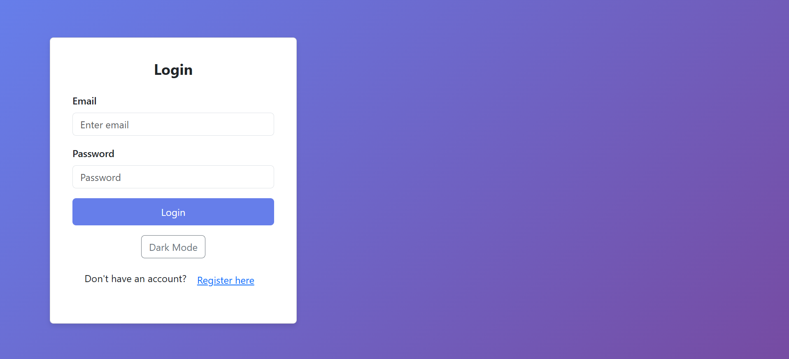
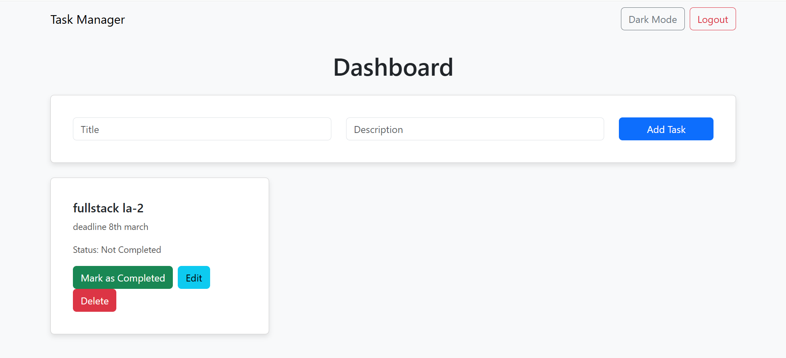

# Task Manager

Task Manager is a full-stack web application designed to help users efficiently manage their tasks. With a user-friendly interface, it allows users to create, edit, delete, and mark tasks as completed. The application also features user authentication and a dark mode toggle for enhanced user experience.

---

## Features

- **User Authentication**:
  - Secure registration and login functionality.
  - JWT-based authentication for secure access.

- **Task Management**:
  - Create new tasks with a title and description.
  - Edit existing tasks to update their details.
  - Delete tasks that are no longer needed.
  - Mark tasks as completed or incomplete.

- **Dark Mode**:
  - Toggle between light and dark themes for better readability and reduced eye strain.

- **Responsive Design**:
  - Works seamlessly on both desktop and mobile devices.

---

## Technologies Used

### Frontend
- **React.js**: A JavaScript library for building user interfaces.
- **React Bootstrap**: For responsive and pre-styled components.
- **Axios**: For making HTTP requests to the backend.

### Backend
- **Node.js**: A JavaScript runtime for building the server.
- **Express.js**: A web framework for Node.js.
- **MongoDB**: A NoSQL database for storing tasks and user data.
- **Mongoose**: An ODM (Object Data Modeling) library for MongoDB.
- **JWT (JSON Web Tokens)**: For secure user authentication.

---

## Installation

### Prerequisites
- Node.js (v16 or higher)
- MongoDB (local or cloud instance)

### Steps
1. **Clone the repository**:
   
   git clone https://github.com/ADubey7/task-manager.git

   cd task-manager

Install dependencies:

For the backend:

cd backend

npm install

For the frontend:

cd ../frontend

npm install

Set up environment variables:

Create a .env file in the backend directory and add the following:

MONGO_URI=mongodb://localhost:27017/task-manager
JWT_SECRET=your_jwt_secret_key
PORT=5000

Start the backend server:

cd backend

npm start

Start the frontend development server:

cd ../frontend

npm start

Access the application:

Open your browser and navigate to http://localhost:3000.

## Screenshots

### Login Page

### Dashboard

Contributing

We welcome contributions! To contribute, please follow these steps:

Fork the repository.

Create a new branch:

git checkout -b feature/YourFeatureName

Commit your changes:

git commit -m "Add some feature"

Push to the branch:

git push origin feature/YourFeatureName

Open a Pull Request on GitHub.

License:-

This project is licensed under the MIT License. See the LICENSE file for details.

Acknowledgments:-

React – Frontend framework.

Express.js – Backend framework.

MongoDB – Database.

Bootstrap – UI components.

Contact:-

For any questions or feedback, feel free to reach out:

📧 Email: honeyashish72@gmail.com
🐙 GitHub: ADubey7

