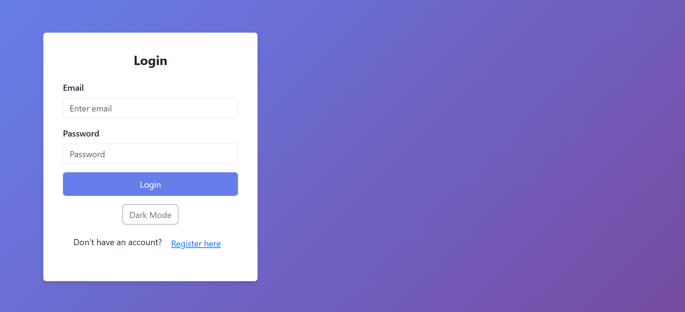
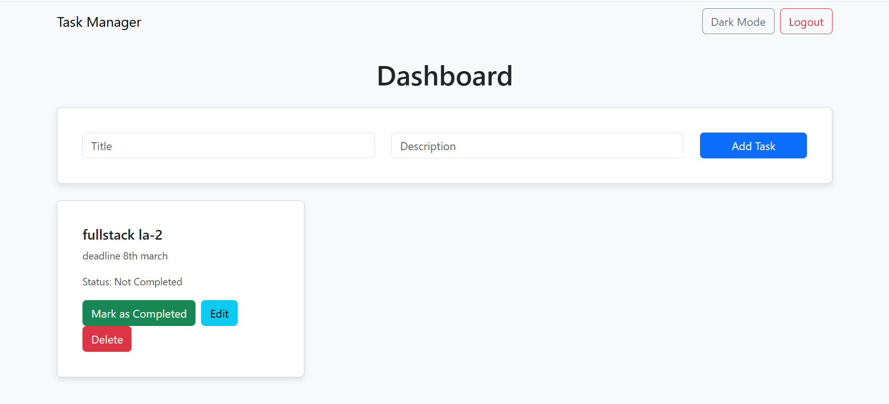

# Task Manager

Task Manager is a full-stack web application designed to help users efficiently manage their tasks. It provides a user-friendly interface for creating, editing, deleting, and marking tasks as completed. The application includes secure user authentication and a dark mode toggle for an enhanced user experience.

---

## 📌 Features

### 🔐 User Authentication
- Secure user registration and login functionality.
- JWT-based authentication for session security.

### ✅ Task Management
- Create, edit, and delete tasks with title and description.
- Mark tasks as completed or incomplete.

### 🌙 Dark Mode
- Toggle between light and dark themes for better readability and reduced eye strain.

### 📱 Responsive Design
- Optimized for both desktop and mobile devices.

---

## 🛠️ Technologies Used

### Frontend:
- **React.js** – JavaScript library for building UI components.
- **React Bootstrap** – Pre-styled components for responsive design.
- **Axios** – HTTP client for API requests.

### Backend:
- **Node.js** – JavaScript runtime for server-side development.
- **Express.js** – Web framework for handling API routes.
- **MongoDB** – NoSQL database for data storage.
- **Mongoose** – ODM (Object Data Modeling) for MongoDB.
- **JWT (JSON Web Token)** – Secure authentication mechanism.

---

## 🚀 Installation Guide

### 📋 Prerequisites
- Install **Node.js** (v16 or higher)
- Set up **MongoDB** (local or cloud instance)

### 📂 Steps to Run the Project

1️⃣ **Clone the repository:**
```sh
 git clone https://github.com/ADubey7/task-manager.git
 cd task-manager
```

2️⃣ **Install dependencies:**

For the **backend**:
```sh
 cd backend
 npm install
```

For the **frontend**:
```sh
 cd ../frontend
 npm install
```

3️⃣ **Set up environment variables:**
Create a `.env` file in the **backend** directory and add:
```sh
 MONGO_URI=mongodb://localhost:27017/task-manager
 JWT_SECRET=your_jwt_secret_key
 PORT=5000
```

4️⃣ **Start the backend server:**
```sh
 cd backend
 npm start
```

5️⃣ **Start the frontend development server:**
```sh
 cd ../frontend
 npm start
```

6️⃣ **Access the application:**
- Open your browser and navigate to: **http://localhost:3000**

---

## 📷 Screenshots

### 🔑 Login Page


### 📋 Dashboard


---

## 🤝 Contributing
We welcome contributions! Follow these steps to contribute:

1. **Fork the repository.**
2. **Create a new branch:**
   ```sh
   git checkout -b feature/YourFeatureName
   ```
3. **Commit your changes:**
   ```sh
   git commit -m "Add some feature"
   ```
4. **Push to the branch:**
   ```sh
   git push origin feature/YourFeatureName
   ```
5. **Open a Pull Request on GitHub.**

---

## 📜 License
This project is licensed under the **MIT License**. See the `LICENSE` file for details.

---

## 🙌 Acknowledgments
- **React.js** – Frontend framework.
- **Express.js** – Backend framework.
- **MongoDB** – Database.
- **Bootstrap** – UI components.

---

## 📬 Contact
For any questions or feedback, feel free to reach out:

📧 **Email**: honeyashish72@gmail.com  
🐙 **GitHub**: [ADubey7](https://github.com/ADubey7)

